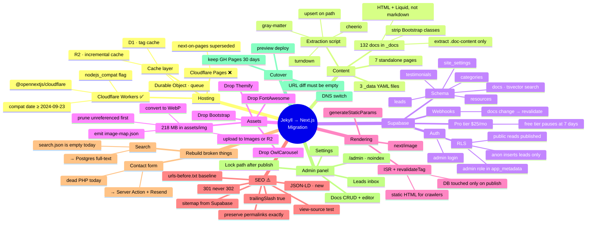

# Migration Plan — docs.learncomputer.in

**From:** Jekyll + GitHub Pages
**To:** Next.js (App Router) + Supabase + Cloudflare Workers
**Content model:** Option B — content lives in Supabase, edited via admin panel, served as server-rendered + edge-cached HTML
**Written:** 2026-07-24

---

## 0. The hosting answer, up front

> **Question:** Is Next.js good for Cloudflare Pages hosting?
> **Answer:** Next.js is a good fit for Cloudflare. **Cloudflare Pages is not.**

Cloudflare has moved its Next.js story off Pages:

| Path | Status | Verdict |
|---|---|---|
| `@cloudflare/next-on-pages` → Cloudflare **Pages** | Superseded. No longer covered in Cloudflare's Next.js framework guide. | ❌ Do not start here |
| `@opennextjs/cloudflare` → Cloudflare **Workers** | Current, documented, recommended path | ✅ Use this |

Cloudflare's own Pages→Workers migration guide states Workers supports 25+ features Pages does not (Cron Triggers, native Durable Objects, Workers Logs, Tail Workers, source maps, remote dev). Pages still works and isn't formally deprecated, but all new investment is in Workers. For a project starting today, starting on Pages means planning a migration you haven't done yet.

**What OpenNext on Workers supports:** App Router, Pages Router, Route Handlers, SSR, SSG, **ISR**, Server Components, Server Actions, streaming, Partial Prerendering, composable caching, Middleware, and Image Optimization via Cloudflare Images.

**Known gap:** Node.js runtime in Middleware (Next 15.2+) is not yet supported. Keep middleware on the edge runtime — trivial for this project, since our middleware only guards `/admin`.

**Requirements:** `nodejs_compat` compatibility flag, and `compatibility_date` of `2024-09-23` or later.

### The architecture this unlocks

This is the key insight for the whole migration. Do **not** hit Supabase on every page request — that's slow and burns your database quota on bot traffic.

```
Editor clicks Publish in /admin
      ↓
Supabase Database Webhook fires
      ↓
POST /api/revalidate  (secret-protected)
      ↓
revalidateTag('doc:css/css-flexbox')
      ↓
Next regenerates that one page, stores it in R2
      ↓
Every subsequent visitor + Googlebot gets static HTML from the edge
```

You get DB-backed editing **and** static-HTML SEO. Supabase is touched only on publish and on the first request after a revalidation — not per pageview. This directly addresses the SEO risk that normally kills a Jekyll→React migration for a search-dependent docs site.

---

## 1. Where you're starting from

Audit of this repo as of 2026-07-24:

| Item | Current state | Migration impact |
|---|---|---|
| Doc pages | 132 files in `_docs/` across 6 categories (basic, css, design, html, javascript, react) | Largest single workstream — see Stage 3 |
| Page format | `.md` files containing **raw HTML + Liquid includes**, not clean markdown | Cannot be copied as-is; needs a parser |
| Standalone pages | `index`, `about`, `contact`, `resourses`, `syllabus`, `box-model`, `box-shadow-generator`, `404` | Hand-port (7 pages) |
| Posts | 1 file in `_posts/` | Trivial |
| Data files | `_data/contact.yml`, `testimonials.yml`, `resources.yml` | → Supabase tables |
| Layouts / includes | 3 layouts, 8 includes — including **4 near-duplicate sidebars** | Collapse into 1 data-driven component |
| Assets | **222 MB total, 218 MB in `assets/img`** | Must leave the repo entirely — see Stage 4 |
| Front-end libs | Bootstrap, FontAwesome, Themify Icons, OwlCarousel2 | Drop all four |
| Search | **Broken** — `search.json` is 0 bytes, `_includes/search.html` is a bare form with no JS | Rebuild properly |
| Contact form | Posts to `<?=$_SERVER['PHP_SELF']?>` — **dead PHP, silently failing on GitHub Pages** | Rebuild; you may have been losing leads |
| URLs | Per-file `permalink:` e.g. `basic/basic-computer/` (overrides the `/docs/:path/` collection default) | **Must be preserved byte-for-byte** |

### The content problem, concretely

Your doc files look like this:

```
---
layout: documentation
title: Fundamentals of Computer | Learn Computer Academy
permalink: basic/basic-computer/
---
<div class="loader">
  
  
  <div class="page-content">
    <div class="content-wrapper">
      <div class="row">
        <div class="col-md-9 content">
          <div class="doc-content">
            <h1>Fundamentals of Computer</h1>
            ...actual content...
```

Only the inside of `.doc-content` is real content. Everything else is Bootstrap grid scaffolding and Liquid includes that the new app replaces. **Treat extraction as an engineering task with a script, not a copy-paste task.** 132 files × manual cleanup is a week of tedium and guaranteed inconsistency.

---

## 2. Target architecture

```
┌──────────────────────────────────────────────────────────┐
│  Cloudflare Workers  (via @opennextjs/cloudflare)        │
│                                                          │
│  Next.js 15 App Router                                   │
│   ├── /                      ISR                         │
│   ├── /[category]/[slug]     ISR + tag-based revalidate   │
│   ├── /contact               static + Server Action       │
│   ├── /resources /syllabus   ISR                          │
│   ├── /admin/*               client-rendered, noindex     │
│   └── /api/revalidate        webhook receiver             │
└──────────────────────────────────────────────────────────┘
     │ R2 (incremental cache)  │ D1 (tag cache)  │ DO (queue)
     │
     ├─► Supabase  ── Postgres (docs, categories, testimonials,
     │                          resources, leads, settings)
     │             ── Auth (admin login) + RLS
     │             ── Database Webhooks → /api/revalidate
     │
     ├─► Cloudflare Images / R2  ── the 218 MB of images
     ├─► Resend                  ── contact form email
     └─► Turnstile               ── form spam protection
```

**Stack decisions:**

| Concern | Choice | Why |
|---|---|---|
| Framework | Next.js 15, App Router | ISR + tag revalidation is the feature that makes Option B viable |
| Adapter | `@opennextjs/cloudflare` | Cloudflare's current recommended path |
| Host | Cloudflare **Workers** (not Pages) | See §0 |
| Styling | Tailwind CSS | Replaces Bootstrap; kills the unused-CSS problem |
| Components | shadcn/ui | Copy-in, no runtime dep, easy to match your new UI design |
| Icons | lucide-react | Replaces FontAwesome + Themify (~3 MB of icon fonts → tree-shaken SVG) |
| DB client | `@supabase/ssr` | Correct cookie handling for App Router server components |
| Editor | Tiptap or Plate | Rich text for non-technical editors |
| Search | Postgres full-text (`tsvector`) | Content is in the DB already; no separate index to maintain |
| Email | Resend | Simple API, works from a Worker |
| Forms/validation | react-hook-form + Zod | Zod schemas shared between client and Server Actions |

> ⚠️ You pasted a 14-line tech stack that didn't reach me. If it differs from the above, tell me and I'll reconcile — particularly if it specified Vite/SPA (incompatible with the SEO strategy here) or a different host.

---

## 3. Stages

Effort assumes one developer. The UI build is the widest variable since it depends on the design you're supplying.

| Stage | Work | Effort | Blocks |
|---|---|---|---|
| 0 | Baseline & URL inventory | 0.5 d | everything |
| 1 | Scaffold Next.js + OpenNext + Workers | 0.5 d | — |
| 2 | Supabase schema, RLS, auth | 1–2 d | 3, 5, 7 |
| 3 | Content extraction (132 files) | 2–4 d | 5, 9 |
| 4 | Asset migration (218 MB) | 1 d | 3 |
| 5 | Public site build | 5–10 d | 6, 9 |
| 6 | ISR + revalidation wiring | 1 d | 10 |
| 7 | Admin panel | 3–5 d | — |
| 8 | Forms, search, analytics | 2 d | — |
| 9 | SEO parity & QA | 2 d | 10 |
| 10 | Cutover | 0.5 d | — |
| 11 | Post-launch watch | 2 weeks (passive) | — |

**Realistic total: 4–6 weeks.** Stages 3, 4, and 7 can run parallel to 5 if you have help.

---

### Stage 0 — Baseline & URL inventory

**Do this before writing any code.** It's the acceptance test for the entire migration.

```bash
# Extract every live URL from the permalink frontmatter
grep -rh "^permalink:" _docs/ *.markdown *.html \
  | sed 's/permalink: *//' | tr -d '"' | sort -u > urls-before.txt
wc -l urls-before.txt   # expect ~139
```

Also capture:
- **Search Console** — top 100 pages by impressions and clicks. Export as CSV. These are the pages you cannot afford to break.
- **Current Lighthouse scores** for 3 representative pages (home, a doc page, contact). You need a before-number to prove the migration was worth it.
- **Current sitemap.xml and robots.txt** contents.
- Full backup: `git tag pre-migration && git push --tags`

**Exit criteria:** `urls-before.txt` committed to the repo, Search Console export saved.

---

### Stage 1 — Scaffold

```bash
npm create cloudflare@latest -- learncomputer-docs --framework=next --platform=workers
cd learncomputer-docs
npm i @supabase/supabase-js @supabase/ssr zod react-hook-form lucide-react
npx shadcn@latest init
```

Create the Cloudflare resources the cache layer needs:

```bash
npx wrangler r2 bucket create lca-next-cache
npx wrangler d1 create lca-tag-cache
```

**`wrangler.jsonc`:**

```jsonc
{
  "$schema": "node_modules/wrangler/config-schema.json",
  "name": "learncomputer-docs",
  "main": ".open-next/worker.js",
  "compatibility_date": "2025-06-01",
  "compatibility_flags": ["nodejs_compat", "global_fetch_strictly_public"],
  "assets": {
    "directory": ".open-next/assets",
    "binding": "ASSETS"
  },
  "r2_buckets": [
    { "binding": "NEXT_INC_CACHE_R2_BUCKET", "bucket_name": "lca-next-cache" }
  ],
  "d1_databases": [
    { "binding": "NEXT_TAG_CACHE_D1", "database_name": "lca-tag-cache", "database_id": "<from create output>" }
  ],
  "durable_objects": {
    "bindings": [
      { "name": "NEXT_CACHE_DO_QUEUE", "class_name": "DOQueueHandler" }
    ]
  },
  "migrations": [
    { "tag": "v1", "new_sqlite_classes": ["DOQueueHandler"] }
  ]
}
```

**`open-next.config.ts`:**

```ts
import { defineCloudflareConfig } from "@opennextjs/cloudflare";
import r2IncrementalCache from "@opennextjs/cloudflare/overrides/incremental-cache/r2-incremental-cache";
import doQueue from "@opennextjs/cloudflare/overrides/queue/do-queue";
import d1NextTagCache from "@opennextjs/cloudflare/overrides/tag-cache/d1-next-tag-cache";

export default defineCloudflareConfig({
  incrementalCache: r2IncrementalCache,   // stores rendered pages
  queue: doQueue,                          // dedupes time-based revalidation
  tagCache: d1NextTagCache,                // powers revalidateTag
});
```

> `D1NextTagCache` suits low-to-moderate traffic — correct for a docs site. If `revalidateTag` volume ever gets heavy, swap to `DOShardedTagCache`. Verify exact import paths against opennext.js.org/cloudflare at implementation time; the override module paths have moved between releases.

**Exit criteria:** `npm run preview` serves a Next.js hello-world from the Workers runtime locally; `npx wrangler deploy` puts it on a `*.workers.dev` URL.

---

### Stage 2 — Supabase schema, RLS, auth

```sql
create table categories (
  id          uuid primary key default gen_random_uuid(),
  slug        text unique not null,        -- 'css', 'javascript', 'react'
  title       text not null,
  description text,
  icon        text,
  sort_order  int not null default 0
);

create table docs (
  id               uuid primary key default gen_random_uuid(),
  category_id      uuid references categories(id) on delete restrict,
  slug             text not null,          -- 'css-flexbox'
  path             text unique not null,   -- 'css/css-flexbox'  ← from Jekyll permalink
  title            text not null,
  meta_title       text,
  meta_description text,
  body_html        text,                   -- sanitized, rendered
  body_md          text,                   -- editable source
  toc              jsonb,                  -- [{id, text, level}]
  status           text not null default 'draft'
                     check (status in ('draft','published')),
  sort_order       int not null default 0,
  search_vector    tsvector generated always as (
                     setweight(to_tsvector('english', coalesce(title,'')), 'A') ||
                     setweight(to_tsvector('english', coalesce(body_md,'')), 'B')
                   ) stored,
  created_at       timestamptz default now(),
  updated_at       timestamptz default now(),
  published_at     timestamptz
);
create index docs_search_idx on docs using gin(search_vector);
create index docs_path_idx   on docs(path);

create table testimonials (
  id uuid primary key default gen_random_uuid(),
  name text not null, course text, testimonial text not null,
  image_url text, rating int check (rating between 1 and 5),
  published boolean default false, sort_order int default 0
);

create table resources (
  id uuid primary key default gen_random_uuid(),
  group_name text not null,                -- 'free_images', 'fonts', ...
  name text not null, url text not null,
  thumbnail_url text, sort_order int default 0
);

create table leads (
  id uuid primary key default gen_random_uuid(),
  name text not null, email text not null, phone text,
  message text, source text, status text default 'new',
  created_at timestamptz default now()
);

create table site_settings (           -- replaces _data/contact.yml
  key text primary key, value jsonb not null
);
```

**RLS — get this right before real data goes in.** This is the most common way Supabase projects leak.

```sql
alter table docs         enable row level security;
alter table categories   enable row level security;
alter table testimonials enable row level security;
alter table resources    enable row level security;
alter table leads        enable row level security;
alter table site_settings enable row level security;

-- Public: read published content only
create policy "public reads published docs" on docs
  for select using (status = 'published');
create policy "public reads categories" on categories
  for select using (true);
create policy "public reads published testimonials" on testimonials
  for select using (published = true);
create policy "public reads resources" on resources
  for select using (true);
create policy "public reads settings" on site_settings
  for select using (true);

-- Public: submit leads, never read them
create policy "anyone can submit a lead" on leads
  for insert with check (true);

-- Admins: full control
create policy "admins manage docs" on docs
  for all using (auth.jwt() ->> 'role' = 'admin')
       with check (auth.jwt() ->> 'role' = 'admin');
-- repeat the admin policy for each table, including leads select
```

**Rules, non-negotiable:**
- `SUPABASE_SERVICE_ROLE_KEY` lives only in Worker secrets (`wrangler secret put`). Never in a `NEXT_PUBLIC_*` var, never in client components.
- The browser only ever sees `NEXT_PUBLIC_SUPABASE_ANON_KEY`, and RLS is what protects you.
- Create your admin user manually in the Supabase dashboard and set `role: admin` in `app_metadata` (users cannot edit `app_metadata`; they **can** edit `user_metadata` — don't put the role there).

> 💰 **Budget note:** Supabase's free tier pauses a project after 7 days of inactivity. Fine for development; not acceptable for production. Plan on the $25/mo Pro tier. With the ISR architecture in §0, Supabase sees very little traffic — but it must still be awake when a revalidation fires.

**Exit criteria:** Schema applied, RLS verified by attempting a `select` on `leads` with the anon key (must return 0 rows, not an error-free dump), admin can log in.

---

### Stage 3 — Content extraction ⭐ the critical path

Write a **one-off Node script**, run it repeatedly against a scratch Supabase project until the diff is clean. Do not hand-migrate.

```bash
npm i -D gray-matter cheerio turndown @supabase/supabase-js
```

`scripts/extract-docs.mjs`:

```js
import fs from "node:fs/promises";
import path from "node:path";
import matter from "gray-matter";
import * as cheerio from "cheerio";
import TurndownService from "turndown";

const td = new TurndownService({ codeBlockStyle: "fenced" });
const imageMap = JSON.parse(await fs.readFile("scripts/image-map.json", "utf8")); // from Stage 4
const report = { ok: [], warn: [], fail: [] };

for (const file of await walk("_docs")) {
  const raw = await fs.readFile(file, "utf8");
  const { data: fm, content } = matter(raw);

  // 1. Strip Liquid — , , {{ site.x }}
  const noLiquid = content
    .replace(/\{%[\s\S]*?%\}/g, "")
    .replace(/\{\{[\s\S]*?\}\}/g, "");

  // 2. Keep only the real content
  const $ = cheerio.load(noLiquid);
  const $content = $(".doc-content").first();
  if (!$content.length) { report.fail.push({ file, why: "no .doc-content" }); continue; }

  // 3. Rewrite asset paths to the CDN
  $content.find("img").each((_, el) => {
    const src = $(el).attr("src");
    const mapped = imageMap[src?.replace(/^\//, "")];
    if (mapped) $(el).attr("src", mapped);
    else report.warn.push({ file, why: `unmapped image ${src}` });
  });

  // 4. Strip Bootstrap classes so Tailwind/prose can take over
  $content.find("[class]").each((_, el) => {
    const keep = ($(el).attr("class") || "")
      .split(/\s+/)
      .filter(c => /^(language-|hljs)/.test(c));
    keep.length ? $(el).attr("class", keep.join(" ")) : $(el).removeAttr("class");
  });

  // 5. Build TOC from headings (your docs use in-page #chp1 anchors)
  const toc = $content.find("h2, h3").map((_, el) => ({
    id: $(el).attr("id") || slugify($(el).text()),
    text: $(el).text().trim(),
    level: el.tagName === "h2" ? 2 : 3,
  })).get();

  const html = $content.html();
  records.push({
    path: (fm.permalink || "").replace(/^\/|\/$/g, ""),   // ← preserves live URLs
    slug: path.basename(file, ".md"),
    category_slug: path.basename(path.dirname(file)),
    title: (fm.title || "").split("|")[0].trim(),
    meta_title: fm.title,
    body_html: html,
    body_md: td.turndown(html),
    toc,
    status: "published",
  });
  report.ok.push(file);
}

await fs.writeFile("scripts/extract-report.json", JSON.stringify(report, null, 2));
console.log(`ok=${report.ok.length} warn=${report.warn.length} fail=${report.fail.length}`);
```

Then upsert on `path` (idempotent, so you can re-run safely):

```js
await supabase.from("docs").upsert(records, { onConflict: "path" });
```

**Expect roughly 10–20 files to need manual cleanup** — inconsistent markup, nested tables, inline `<style>`, code samples that Turndown mangles. That's what `extract-report.json` is for. Work the `fail` list first, then `warn`.

**Verification, per file:**
1. Count of `docs` rows == 132
2. Every `path` in `urls-before.txt` has a matching row
3. Spot-check 10 pages side by side against the live site
4. Grep the DB for leftovers: `{%`, `{{`, `col-md-`, `class="loader"`

**Exit criteria:** `fail` list empty, 132 rows, no Liquid or Bootstrap residue in `body_html`.

---

### Stage 4 — Assets (218 MB)

**These must not go into the repo or the Worker bundle.** Workers has a hard per-file asset limit and a total-bundle limit; a 222 MB `assets/` folder will make builds slow and fragile.

```bash
# 1. What are we actually dealing with?
find assets/img -type f | wc -l
du -sh assets/img/*

# 2. Prune first — Jekyll sites accumulate orphans.
#    Cross-check every image against references in _docs/ before uploading.
```

**Order of operations:**
1. **Prune.** Build the list of images actually referenced by the 132 doc files. Anything unreferenced does not get migrated. On a site this old, expect to drop 30–50% of that 218 MB for free.
2. **Convert.** Batch to WebP (`sharp` or `cwebp`), quality 80, max width 1600px. Typically another 60–70% reduction.
3. **Upload** to Cloudflare Images (automatic resizing + format negotiation, integrates with `next/image` through OpenNext) or R2 + a custom domain (cheaper, more manual).
4. **Emit `scripts/image-map.json`** — `{ "assets/img/css/flexbox.png": "https://cdn.../flexbox.webp" }`. Stage 3 consumes this.
5. Keep only genuine site chrome (logo, favicons, OG image) in `public/`.

**Exit criteria:** `image-map.json` covers every referenced image; `public/` is under 5 MB; zero broken images after the Stage 3 re-run.

---

### Stage 5 — Public site build

Route structure that preserves your existing URLs exactly:

```
app/
├─ layout.tsx
├─ page.tsx                          →  /
├─ [category]/[slug]/page.tsx        →  /css/css-flexbox   ← the 132 docs
├─ contact/page.tsx
├─ resources/page.tsx
├─ syllabus/page.tsx
├─ box-model/page.tsx                (port as a client component)
├─ box-shadow-generator/page.tsx     (port as a client component)
├─ not-found.tsx
├─ sitemap.ts                        (generated from Supabase)
├─ robots.ts
├─ api/revalidate/route.ts
└─ admin/…                           (Stage 7)
```

The doc page — this is where ISR + tags come together:

```tsx
// app/[category]/[slug]/page.tsx
export const revalidate = 3600;          // hourly safety net
export const dynamicParams = true;        // new docs work without a redeploy

export async function generateStaticParams() {
  const { data } = await supabase.from("docs")
    .select("path").eq("status", "published");
  return data.map(d => {
    const [category, slug] = d.path.split("/");
    return { category, slug };
  });
}

export async function generateMetadata({ params }) {
  const doc = await getDoc(params);
  return {
    title: doc.meta_title ?? doc.title,
    description: doc.meta_description,
    alternates: { canonical: `https://docs.learncomputer.in/${doc.path}/` },
  };
}

export default async function DocPage({ params }) {
  const doc = await getDoc(params);       // tagged fetch — see below
  if (!doc) notFound();
  return <Article doc={doc} />;
}
```

**Component work — the wins to bank here:**

- **One sidebar, not four.** You currently maintain `sidebar.html`, `sidebar-general.html`, `sidebar-resourses.html`, `sidebar-syllabus.html`. Replace with a single `<DocSidebar />` driven by `categories` + `docs.sort_order`. Adding a lesson becomes a DB insert, not a template edit.
- **Drop Bootstrap, FontAwesome, Themify, OwlCarousel.** ~3.5 MB of CSS/JS/fonts gone. This is the single biggest performance win available.
- **Style `body_html` with `@tailwindcss/typography`** (`prose` class) so migrated content looks right without per-page fixes.
- **Code blocks:** `rehype-pretty-code` / Shiki at render time, not a client-side highlighter.
- **`next/image` everywhere** with explicit `width`/`height` — prevents the CLS and unsized-image problems.

**Exit criteria:** All 139 routes render; visual parity with the new design; Lighthouse ≥ 90 on a representative doc page.

---

### Stage 6 — ISR + revalidation wiring

Tag every doc fetch:

```ts
// lib/docs.ts
export async function getDoc({ category, slug }) {
  const path = `${category}/${slug}`;
  return unstable_cache(
    async () => {
      const { data } = await supabase.from("docs")
        .select("*, categories(*)").eq("path", path)
        .eq("status", "published").single();
      return data;
    },
    [`doc-${path}`],
    { tags: [`doc:${path}`, "docs"], revalidate: 3600 }
  )();
}
```

Receive the webhook:

```ts
// app/api/revalidate/route.ts
export async function POST(req: Request) {
  if (req.headers.get("x-revalidate-secret") !== process.env.REVALIDATE_SECRET) {
    return new Response("Unauthorized", { status: 401 });
  }
  const { record, old_record } = await req.json();
  revalidateTag(`doc:${record?.path ?? old_record?.path}`);
  revalidateTag("docs");                 // sidebar / listing pages
  revalidatePath("/sitemap.xml");
  return Response.json({ revalidated: true });
}
```

Wire it in Supabase: **Database → Webhooks → new hook** on `docs` for INSERT/UPDATE/DELETE → POST to `https://docs.learncomputer.in/api/revalidate` with the `x-revalidate-secret` header.

**Also configure cache purge.** OpenNext's cache-purge component clears Cloudflare's edge cache on revalidation; it needs a Cloudflare API token and zone ID in your Worker config. Without it, revalidated pages can still be served stale from the edge — a confusing bug to chase later.

**Exit criteria:** Edit a doc in Supabase → the live page reflects it within ~5 seconds → and `curl -I` shows it's still being served as a cached static response, not dynamically rendered.

---

### Stage 7 — Admin panel

`/admin`, gated by Supabase Auth, `noindex` in metadata, and a middleware guard (edge runtime only — Node middleware isn't supported on Workers yet).

| Screen | Function |
|---|---|
| Dashboard | Counts, recent leads, recently edited docs |
| Docs list | Filter by category/status, drag to reorder |
| Doc editor | Title, slug, **path (locked once published — changing it breaks SEO)**, meta title/description, rich body, draft/publish toggle |
| Categories | CRUD + ordering |
| Testimonials | CRUD + publish toggle |
| Resources | CRUD, grouped |
| Leads inbox | Read, mark status, CSV export |
| Settings | `site_settings` — phone, email, address, social links |

**Design notes:**
- Client-rendered is fine here. No SEO concern behind auth.
- Guard the `path` field. An editor casually renaming a URL undoes Stage 9's work. Lock it after first publish, or auto-create a redirect when it changes.
- Preview before publish: render the doc page with `status='draft'` visible to authenticated admins only.

---

### Stage 8 — Forms, search, analytics

**Contact form** — replaces the dead PHP:
```
Server Action → Zod validate → Turnstile verify → insert into leads
             → Resend notification email → success state
```
Rate-limit by IP. Log failures; a silently failing contact form is how you got here.

**Search** — replaces the empty `search.json`:
```sql
select path, title, ts_headline('english', body_md, query) as excerpt
from docs, websearch_to_tsquery('english', $1) query
where search_vector @@ query and status = 'published'
order by ts_rank(search_vector, query) desc limit 20;
```
Wrap in a Route Handler, debounce the input, cache popular queries. This is genuinely new functionality — search has never worked on this site.

**Analytics:** Cloudflare Web Analytics (free, no cookie banner, no JS weight) — or GA4 through the `@next/third-parties` package if you need it.

---

### Stage 9 — SEO parity ⚠️ highest-risk stage

This is where Jekyll→React migrations lose traffic. Work the checklist.

```bash
# Crawl the preview deployment and diff against the Stage 0 baseline
npx wrangler deploy --name lca-preview
# crawl → urls-after.txt
comm -23 urls-before.txt urls-after.txt   # MUST be empty
```

- [ ] Every URL in `urls-before.txt` returns 200 on the new site
- [ ] Trailing slashes match the old behaviour exactly (`/css/css-flexbox/` vs `/css/css-flexbox`) — set `trailingSlash: true` in `next.config` to match Jekyll
- [ ] **View source** on a doc page and confirm the content is in the HTML, not injected by JS. If it isn't, ISR isn't working — stop and fix before cutover.
- [ ] `sitemap.xml` generated from Supabase, all published docs present
- [ ] `robots.txt` allows crawling; `/admin` disallowed
- [ ] Canonical tags absolute and self-referencing
- [ ] Title + meta description carried over per page
- [ ] OG/Twitter cards present
- [ ] `Article` / `BreadcrumbList` JSON-LD (an upgrade — you have none today)
- [ ] Any unavoidable URL change has a **301** in `_redirects` (never 302)
- [ ] Lighthouse ≥ 90 across Performance / SEO / Accessibility / Best Practices
- [ ] Mobile rendering verified in Search Console's URL Inspection tool

---

### Stage 10 — Cutover

1. Deploy to production Worker; verify on `*.workers.dev`.
2. Add the custom domain `docs.learncomputer.in` in the Workers dashboard.
3. Update DNS to point at the Worker. **Leave the GitHub Pages repo untouched** — it's your rollback.
4. Verify SSL, then smoke-test 20 URLs including your Search Console top-10.
5. Submit the new sitemap in Search Console.
6. Test the contact form end-to-end with a real submission.
7. Confirm publishing from `/admin` reaches the live site.

**Rollback:** revert the DNS record. GitHub Pages is still serving. Keep it live for at least 30 days.

---

### Stage 11 — Post-launch

| When | Check |
|---|---|
| Day 1 | Search Console coverage errors, Worker error logs, form submissions arriving |
| Day 3 | Crawl stats — Googlebot fetching the new URLs? |
| Week 1 | Impressions/clicks vs pre-migration baseline; 404 report |
| Week 2 | Core Web Vitals field data starting to populate |
| Week 4 | Traffic recovered or exceeded → decommission GitHub Pages |

A 10–20% dip in weeks 1–2 is normal while Google re-crawls. A dip that hasn't recovered by week 4 means something is wrong — check rendering first.

---

## 4. Mindmap



---

## 5. Risk register

| Risk | Impact | Mitigation |
|---|---|---|
| **Content not in server HTML** → organic traffic collapse | Critical | ISR per §0 + §6; view-source test is a hard gate in Stage 9 |
| **URL changes** | Critical | `urls-before.txt` diff must be empty before cutover; lock `path` in admin |
| Extraction mangles 132 pages | High | Scripted + idempotent + report file; spot-check 10 manually |
| Service-role key leaks to client | High | Worker secrets only; RLS as defence in depth; grep the build output before deploy |
| Supabase free tier pauses | High | Pro tier before launch |
| 218 MB blows the Worker bundle | Medium | Assets never enter the repo (Stage 4) |
| Edge cache serves stale after publish | Medium | Configure OpenNext cache purge (API token + zone ID) |
| Node middleware unsupported | Low | Keep `/admin` guard on edge runtime |
| Scope creep from the redesign | Medium | Migrate content first, redesign second — don't do both in one pass on the same page |

---

## 6. Open items

1. **Re-paste the 14-line tech stack** — it didn't come through. If it names Vite/SPA, or a different host, the SEO strategy in §0 needs rework.
2. **Confirm the target site.** This plan is for `docs.learncomputer.in` (this repo). The parent `CLAUDE.md` describes `amartadey.com` — a different property.
3. **Send the UI design.** If it's Figma, share the file link and I can pull frames and tokens directly and build components against them.
4. **Confirm Supabase Pro** budget ($25/mo) — the plan assumes it.
5. **Decide on `body_html` vs `body_md` as source of truth.** Recommendation: `body_md` is authoritative post-migration, `body_html` is the rendered cache. Simpler editing, safer sanitization.

---

## Suggested first move

Stage 3 is the critical path and holds all the unknowns. Before committing to the full timeline, run the extraction script against all 132 files and read `extract-report.json`. If the `fail` count is under 15, the schedule above holds. If it's over 40, the content needs more manual work than estimated and every downstream date shifts.
